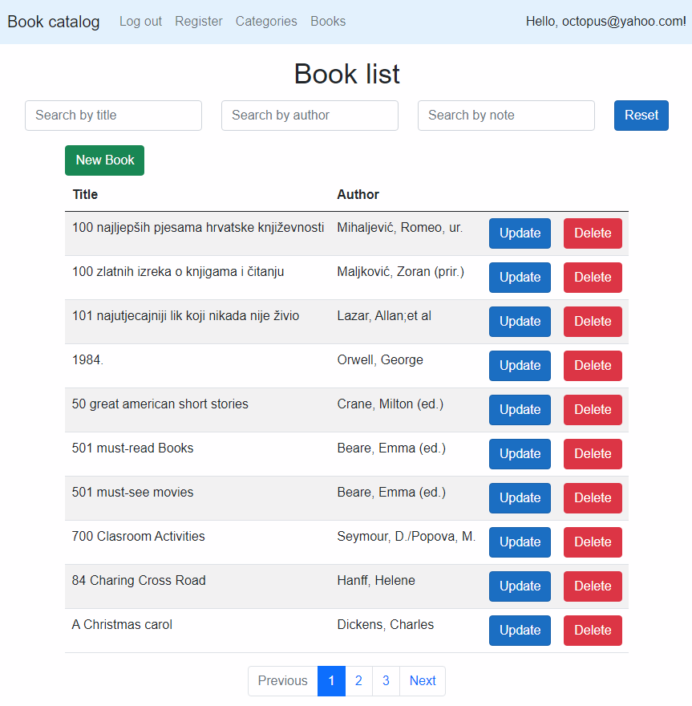

Short overview:
===============

What is this?
-------------

Very simple book catalog web application I created for the purpose of exercise. 

What is utilized?
-------------------

* .NET 5.0 Web API
* MS SQL 2019
* Entity framework 5
* ASP.NET Identity
* Two front-end versions of the same application: Blazor and Angular
* Server-side paging and searching
* Twitter-bootstrap 
* Serilog
* Xunit
* Http interceptors

How to run?
-----------

* Clone or download code

* Open solution (Visual studio 2019 or later)

* In the project "BookCatalog.API" => "appsettings.json", change "server name"  in the connection string if needed

* To run the Blazor app:

  * Click "Start" dropdown menu from the VS menu

  * Choose "Set startup projects..." => "multiple startup projects"

  * Pick two projects: "BookCatalog.API" and "BookCatalog.WebBlz" => "OK"

  * Start the app (VS play button)

  * When app starts, database is created (migrated) with few tables

  * Open the database and execute the sql script from the folder "doc => updateDatabase.sql"

  * Username and password for the running app:

    * octopus@yahoo.com

    * 2xSNzSa$

      

*	To run the Angular app:

  *	TODO
  *	

## Work in progress...

- SSL/TLS Certificate is not setup
- Add custom configuration provider to encrypt  connection string
- Add "Result Pattern", a layer between service and controller which contains the logic of determining if result is eg. "Ok", "Invalid", "Unauthorized" etc. 
  - The point is to remove that logic from controller.
  - https://alexdunn.org/2019/02/25/clean-up-your-client-to-business-logic-relationship-with-a-result-pattern-c/
- There is only one unit test for now. We could add more unit or integration tests
- Account management module is not finished.
